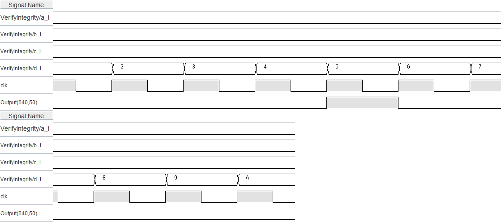

# SYL_Labo1

## Questions

### Question 1

#### D'après vous, à quoi correspond le *bit de carry* dans un additionneur binaire, et pourquoi est-il important dans l'addition de nombres?

Il sert principalement dans des additioneurs à plus de 1 bit. Lorsque deux bits sont additionés, on regarde s'il y a un carry qui doit être pris en compte pour l'addition des deux prochains bits.

### Question 2

#### A partir de la définition proposée, expliquer ce qu'est un *modular sum* à l'aide d'un schéma ou d'une explication simple.

"*Un ```modular sum``` se calcule en additionnant les données entre elles sans carry puis en effectuant le
complément à deux de ce résultat.*"

Un *modular sum* fait référence à une somme de chiffre en utilisant le principe de modulo. Le modulo d'un chiffre représente le reste d'une division entière par ce chiffre.

Ce *modular sum* représente donc la somme de plusieurs nombres en considérant qu'il y a un maximum à partir duquel on recommence à 0. Le maximum en représentation binaire est simplement tous les bits à 1 (e.g. 15 pour 4 bits ou 255 pour 8 bits).

### Question 3

#### Quelle est la valeur de checksum attendue pour les constantes définies?

0000 0101 (trouvée à l'aide du Circuit Checksum et vérifié à la main en faisant les calculs)


### Question 4

#### Sauvegarder le chronogramme (capture d'écran). Quelles observations peut-on faire?

Export


Capture


Il y a un court moment lorsque la sortie du *VerifyIntegrity* est à ```1```.

#### Selon quelles conditions la sortie *VerifyIntegrity* passe-t-elle à 1?

La sortie du *VerifyIntegrity* est à 1 lorsque le compteur atteint la valeur de CheckSum des trois autres entrées.
